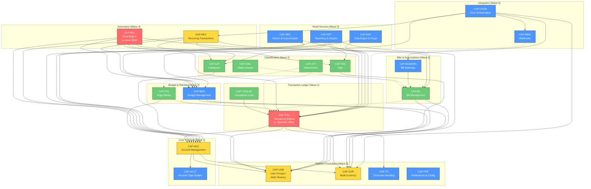

I'll analyze the codebase structure to build an accurate capability map. Let me start by examining key architectural boundaries and cross-module dependencies.Now I have sufficient information from the prior stage outputs and my targeted lookups. Let me produce the comprehensive capability map.

---

# Firefly III — Business Capability Map

## 1. Capability Hierarchy

### Domain Decomposition

The Firefly III application decomposes into **7 top-level business domains** containing **21 capabilities** mapped from Stage 1 entities and Stage 2 BDD features.

| # | Domain | Capabilities | Key Modules |
|---|--------|-------------|-------------|
| D1 | **Financial Accounts** | Account Management, Account Types, Opening Balances | `app/Models/Account.php`, `app/Api/V1/Controllers/Models/Account/` |
| D2 | **Transaction Ledger** | Transaction CRUD, Double-Entry Engine, Split Transactions, Transaction Links, Reconciliation | `app/Models/TransactionJournal.php`, `app/Models/Transaction.php`, `app/Models/TransactionGroup.php`, `app/Api/V1/Controllers/Models/Transaction/` |
| D3 | **Budget & Planning** | Budget Management, Budget Limits, Auto-Budgets, Available Budgets, Piggy Banks | `app/Models/Budget.php`, `app/Models/PiggyBank.php`, `app/Support/Cronjobs/AutoBudgetCronjob.php` |
| D4 | **Bills & Subscriptions** | Bill Management, Bill Matching, Bill Warnings | `app/Models/Bill.php`, `app/Support/Cronjobs/BillWarningCronjob.php` |
| D5 | **Automation** | Rule Engine, Rule Groups, Recurring Transactions | `app/Models/Rule.php`, `app/Models/Recurrence.php`, `app/TransactionRules/Actions/`, `app/Support/Cronjobs/RecurringCronjob.php` |
| D6 | **Classification & Organization** | Categories, Tags, Object Groups, Attachments | `app/Models/Category.php`, `app/Models/Tag.php`, `app/Models/ObjectGroup.php`, `app/Models/Attachment.php` |
| D7 | **Platform Services** | Multi-Currency & Exchange Rates, Multi-Tenancy (User Groups), Webhooks, User Preferences, Search, Reporting & Insights, Data Export/Purge, Cron Orchestration, System Admin | `config/firefly.php`, `app/Support/Cronjobs/`, `app/Api/V1/Controllers/Webhook/`, `app/Api/V1/Controllers/System/` |

---

## 2. Detailed Capability Cards

### D1: Financial Accounts Domain

#### CAP-ACC — Account Management
- **Owner:** `app/Api/V1/Controllers/Models/Account/` (ShowController, StoreController, UpdateController, DestroyController, ListController)
- **Model:** `app/Models/Account.php` — soft-delete enabled, `user_group_id` scoped
- **Upstream Dependencies:** Currency (CAP-CUR), User Group (CAP-UGR)
- **Downstream Consumers:** Transaction Ledger (CAP-TXN), Budget (CAP-BDG), Piggy Bank (CAP-PIG), Bill (CAP-BIL), Reconciliation, Reporting
- **Data Ownership:** `accounts`, `account_meta`, `account_types` tables
- **Coupling:** **TIGHT** — Account types enforce transaction type validity via `config/firefly.php:expected_source_types` and `allowed_opposing_types` (lines 474–600+). Shared DB references from nearly every other domain entity.
- **Change Frequency:** Stable (core entity, rarely changes structure)
- **Stage 2 BDD Coverage:** Feature 1 (BR-ACC-001 – BR-ACC-008) — 8 scenarios ✅
- **Risks:** Central coupling point; any schema change cascades to transactions, rules, and reports

#### CAP-ACCT — Account Type System
- **Owner:** `config/firefly.php` (lines 360–575), enum-driven (`AccountTypeEnum`)
- **Data Ownership:** `account_types` lookup table
- **Coupling:** **TIGHT** — Hardcoded type-to-transaction-type mapping in config; drives all validation logic
- **Stage 2 BDD Coverage:** Covered within BR-ACC-002, BR-ACC-003 ✅
- **Risk:** Enum change requires config, validation, and migration coordination

---

### D2: Transaction Ledger Domain

#### CAP-TXN — Transaction CRUD & Double-Entry Engine
- **Owner:** `app/Api/V1/Controllers/Models/Transaction/` (StoreController, ShowController, UpdateController, DestroyController, ListController)
- **Models:** `app/Models/TransactionJournal.php`, `app/Models/Transaction.php`, `app/Models/TransactionGroup.php`
- **Upstream Dependencies:** Account (CAP-ACC), Currency (CAP-CUR), Category (CAP-CAT), Budget (CAP-BDG), Tag (CAP-TAG), Bill (CAP-BIL)
- **Downstream Consumers:** Piggy Bank events, Rule Engine, Webhooks, Reporting/Insights, Search, Export
- **Data Ownership:** `transaction_journals`, `transactions`, `transaction_groups`, `transaction_types` tables
- **Coupling:** **TIGHT** — Central hub; double-entry enforced via `config/firefly.php:expected_source_types`. Foreign currency support adds `foreign_amount`, `foreign_currency_id` columns. Split transactions via `TransactionGroup` aggregation.
- **Change Frequency:** Volatile (most complex domain; highest code surface area)
- **Stage 2 BDD Coverage:** Feature 2 (BR-TXN-001 – BR-TXN-012) — 12 scenarios ✅
- **Risks:** ⚠️ **HIGHEST RISK** — Most coupled entity in system. Every other domain reads/writes transactions. Schema changes require coordinated migration.

#### CAP-TXNLNK — Transaction Links
- **Owner:** `app/Api/V1/Controllers/Models/TransactionLink/`, `app/Api/V1/Controllers/Models/TransactionLinkType/`
- **Data Ownership:** `journal_links`, `link_types` tables
- **Coupling:** Loose — references `TransactionJournal` by FK only
- **Stage 2 BDD Coverage:** Feature 15 (BR-LNK-001 – BR-LNK-006) — 6 scenarios ✅

---

### D3: Budget & Planning Domain

#### CAP-BDG — Budget Management
- **Owner:** `app/Api/V1/Controllers/Models/Budget/`, `app/Api/V1/Controllers/Models/BudgetLimit/`
- **Models:** `app/Models/Budget.php`, `BudgetLimit`
- **Upstream Dependencies:** Currency (CAP-CUR), User Group (CAP-UGR)
- **Downstream Consumers:** Transaction assignment (only withdrawals), Auto-Budget cron, Reporting
- **Data Ownership:** `budgets`, `budget_limits`, `auto_budgets`, `available_budgets` tables
- **Coupling:** Medium — budget assignment constrained to withdrawals only (`SetBudget.php:54-63`); `budget_transaction_journal` pivot table
- **Change Frequency:** Moderate (auto-budget feature adds complexity)
- **Stage 2 BDD Coverage:** Feature 3 (BR-BDG-001 – BR-BDG-008) — 8 scenarios ✅
- **Business Rule:** Only withdrawals can be assigned to budgets

#### CAP-PIG — Piggy Bank (Savings Goals)
- **Owner:** `app/Api/V1/Controllers/Models/PiggyBank/`
- **Model:** `app/Models/PiggyBank.php`
- **Upstream Dependencies:** Account (CAP-ACC — limited to `piggy_bank_account_types`)
- **Downstream Consumers:** Transaction events create piggy bank events
- **Data Ownership:** `piggy_banks`, `piggy_bank_events`, `piggy_bank_repetitions` tables
- **Coupling:** Medium — references Account; triggers on Transfer transactions
- **Stage 2 BDD Coverage:** Feature 8 (BR-PIG-001 – BR-PIG-007) — 7 scenarios ✅

---

### D4: Bills & Subscriptions Domain

#### CAP-BIL — Bill Management & Matching
- **Owner:** `app/Api/V1/Controllers/Models/Bill/`
- **Model:** `app/Models/Bill.php` — fields: `amount_min`, `amount_max`, `repeat_freq`, `skip`
- **Upstream Dependencies:** Currency (CAP-CUR), User Group (CAP-UGR)
- **Downstream Consumers:** Rule Engine (link_to_bill action), Cron (bill warnings), Reporting
- **Data Ownership:** `bills` table
- **Coupling:** Medium — Bill matching links transactions via pattern matching; `repeat_freq` from `config/firefly.php:bill_periods`
- **Change Frequency:** Stable
- **Stage 2 BDD Coverage:** Feature 4 (BR-BIL-001 – BR-BIL-008) — 8 scenarios ✅

#### CAP-BILWARN — Bill Warning Notifications
- **Owner:** `app/Support/Cronjobs/BillWarningCronjob.php`
- **Upstream Dependencies:** CAP-BIL, Cron Orchestration
- **Stage 2 BDD Coverage:** Partial via Feature 18 (BR-CRN-003) ⚠️

---

### D5: Automation Domain

#### CAP-RUL — Rule Engine
- **Owner:** `app/Api/V1/Controllers/Models/Rule/`, `app/Api/V1/Controllers/Models/RuleGroup/`
- **Model:** `app/Models/Rule.php`
- **Actions:** 25+ action classes in `app/TransactionRules/Actions/` (SetBudget, SetCategory, AddTag, RemoveTag, ConvertTransfer, LinkToBill, SetAmount, etc.)
- **Upstream Dependencies:** Transaction (CAP-TXN), Account (CAP-ACC), Category, Budget, Tag, Bill
- **Downstream Consumers:** Fires on transaction create/update; modifies transactions in place
- **Data Ownership:** `rules`, `rule_groups`, `rule_triggers`, `rule_actions` tables
- **Coupling:** **TIGHT** — Cross-cuts every classification domain (budget, category, tag, bill). Rule actions directly mutate Transaction and related entities. `config/firefly.php:rule-actions` (lines 296–449) defines available actions.
- **Change Frequency:** Volatile (expanding action set, expression validation added)
- **Stage 2 BDD Coverage:** Feature 5 (BR-RUL-001 – BR-RUL-010) — 10 scenarios ✅
- **Risks:** ⚠️ **HIGH RISK** — Rules are a cross-cutting concern touching 6+ domains. Must migrate after all referenced entities.

#### CAP-REC — Recurring Transactions
- **Owner:** `app/Api/V1/Controllers/Models/Recurrence/`
- **Model:** `app/Models/Recurrence.php` — relationships: `RecurrenceRepetition`, `RecurrenceTransaction`, `RecurrenceMeta`
- **Upstream Dependencies:** Account (CAP-ACC), Transaction (CAP-TXN), Currency (CAP-CUR), Budget, Category, Cron
- **Downstream Consumers:** Creates TransactionJournals on schedule via `RecurringCronjob`
- **Data Ownership:** `recurrences`, `recurrences_repetitions`, `recurrences_transactions`, `recurrences_meta` tables
- **Coupling:** Medium-High — must construct full valid transactions including all account-type validation
- **Stage 2 BDD Coverage:** Feature 6 (BR-REC-001 – BR-REC-008) — 8 scenarios ✅

---

### D6: Classification & Organization Domain

#### CAP-CAT — Category Management
- **Owner:** `app/Api/V1/Controllers/Models/Category/`
- **Data Ownership:** `categories`, `category_transaction_journal` pivot table
- **Coupling:** Loose — optional FK from transactions
- **Stage 2 BDD Coverage:** Feature 9 (BR-CAT-001 – BR-CAT-006) — 6 scenarios ✅

#### CAP-TAG — Tag Management
- **Owner:** `app/Api/V1/Controllers/Models/Tag/`
- **Data Ownership:** `tags`, `tag_transaction_journal` pivot table
- **Coupling:** Loose — many-to-many with transactions
- **Stage 2 BDD Coverage:** Feature 10 (BR-TAG-001 – BR-TAG-006) — 6 scenarios ✅

#### CAP-OBG — Object Group Management
- **Owner:** `app/Api/V1/Controllers/Models/ObjectGroup/`
- **Data Ownership:** `object_groups`, `object_groupables` polymorphic pivot
- **Coupling:** Loose — polymorphic grouping of bills and piggy banks
- **Stage 2 BDD Coverage:** Feature 14 (BR-OBG-001 – BR-OBG-005) — 5 scenarios ✅

#### CAP-ATT — Attachment Management
- **Owner:** `app/Api/V1/Controllers/Models/Attachment/`
- **Data Ownership:** `attachments` table, file storage
- **Coupling:** Loose — polymorphic `attachable` to multiple models (`config/firefly.php:valid_attachment_models`)
- **Stage 2 BDD Coverage:** Feature 11 (BR-ATT-001 – BR-ATT-006) — 6 scenarios ✅
- **Risk:** File storage migration requires coordinated infrastructure change

---

### D7: Platform Services Domain

#### CAP-CUR — Multi-Currency & Exchange Rates
- **Owner:** `app/Api/V1/Controllers/Models/TransactionCurrency/`, `app/Api/V1/Controllers/Models/CurrencyExchangeRate/`
- **Data Ownership:** `transaction_currencies`, `currency_exchange_rates` tables
- **Coupling:** **TIGHT** — Referenced by accounts, transactions, budget limits, bills, recurrences. Currency is on nearly every financial entity.
- **Change Frequency:** Stable (schema), Moderate (exchange rate data refresh via `ExchangeRatesCronjob`)
- **Stage 2 BDD Coverage:** Feature 7 (BR-CUR-001 – BR-CUR-007) — 7 scenarios ✅
- **Risk:** ⚠️ Foundational dependency — must be migrated first

#### CAP-UGR — User Group / Multi-Tenancy
- **Owner:** `app/Api/V1/Controllers/Models/UserGroup/`
- **Data Ownership:** `user_groups`, `group_memberships` tables; `user_group_id` FK on all major models
- **Coupling:** **TIGHT** — Tenant scoping column on Account, Transaction, Budget, Bill, Rule, etc.
- **Stage 2 BDD Coverage:** Feature 13 (BR-UGR-001 – BR-UGR-005) — 5 scenarios ✅
- **Risk:** ⚠️ **CRITICAL** — Cross-cutting tenant isolation. Must be preserved in every migrated service.

#### CAP-WHK — Webhook System
- **Owner:** `app/Api/V1/Controllers/Webhook/`
- **Model:** `app/Models/Webhook.php`
- **Data Ownership:** `webhooks`, `webhook_messages`, `webhook_attempts` tables
- **Coupling:** Loose — event-driven; subscribes to transaction lifecycle events
- **Stage 2 BDD Coverage:** Feature 12 (BR-WHK-001 – BR-WHK-008) — 8 scenarios ✅

#### CAP-PRF — User Preferences & Configuration
- **Owner:** `app/Api/V1/Controllers/User/PreferencesController`, `app/Api/V1/Controllers/System/ConfigurationController`
- **Data Ownership:** `preferences`, `configuration` tables
- **Coupling:** Medium — preferences drive UI behavior and some business logic (e.g., `default_preferences` in config)
- **Stage 2 BDD Coverage:** Feature 19 (BR-PRF-001 – BR-PRF-006) — 6 scenarios ✅

#### CAP-RPT — Reporting & Insights
- **Owner:** `app/Api/V1/Controllers/Insight/`, `app/Api/V1/Controllers/Chart/`, `app/Api/V1/Controllers/Summary/`
- **Upstream Dependencies:** Transaction, Account, Budget, Bill, Category, Tag, Currency — **reads from all domains**
- **Coupling:** **READ-ONLY** dependency on all financial data. No writes.
- **Stage 2 BDD Coverage:** Feature 20 (BR-RPT-001 – BR-RPT-006) — 6 scenarios ✅
- **Risk:** Performance-sensitive; candidate for CQRS read-model separation

#### CAP-SRC — Search & Autocomplete
- **Owner:** `app/Api/V1/Controllers/Search/`, `app/Api/V1/Controllers/Autocomplete/`
- **Coupling:** READ-ONLY cross-domain queries
- **Stage 2 BDD Coverage:** Feature 16 (BR-SRC-001 – BR-SRC-006) — 6 scenarios ✅

#### CAP-EXP — Data Export & Purge
- **Owner:** `app/Api/V1/Controllers/Data/Export/`, `app/Api/V1/Controllers/Data/DestroyController`, `app/Api/V1/Controllers/Data/PurgeController`
- **Coupling:** READ + DELETE across all domains
- **Stage 2 BDD Coverage:** Feature 17 (BR-EXP-001 – BR-EXP-005) — 5 scenarios ✅

#### CAP-CRON — Cron Orchestration
- **Owner:** `app/Console/Commands/Tools/Cron.php`, `app/Support/Cronjobs/`
- **Orchestrates:** `AutoBudgetCronjob`, `BillWarningCronjob`, `ExchangeRatesCronjob`, `RecurringCronjob`, `UpdateCheckCronjob`, `WebhookCronjob`
- **Stage 2 BDD Coverage:** Feature 18 (BR-CRN-001 – BR-CRN-006) — 6 scenarios ✅

#### CAP-TZ — Timezone Handling
- **Owner:** `app/Casts/SeparateTimezoneCaster.php`
- **Coupling:** Cross-cutting — used by any model with date/timezone fields
- **Stage 2 BDD Coverage:** Feature 21 (BR-TZ-001 – BR-TZ-005) — 5 scenarios ✅

---

## 3. Dependency Graph

---

## 4. Modernization Waves

### Wave 0 — Platform Foundation
**Scope:** CAP-UGR, CAP-CUR, CAP-TZ, CAP-PRF
**Rationale:** Every other capability depends on tenant scoping (user_group_id), currency references, and timezone handling. These must be established as shared libraries or platform services first.
**Effort:** Low-Medium
**BDD Coverage:** 23 scenarios across 4 features ✅

### Wave 1 — Core Financial Entities
**Scope:** CAP-ACC, CAP-ACCT
**Rationale:** Accounts are the second foundational dependency. Transaction engine cannot function without accounts and type validation.
**Effort:** Medium
**BDD Coverage:** 8 scenarios ✅

### Wave 2 — Transaction Ledger + Classification
**Scope:** CAP-TXN, CAP-TXNLNK, CAP-CAT, CAP-TAG, CAP-OBG, CAP-ATT
**Rationale:** Transaction engine is the central nervous system. Classification entities (Category, Tag) are loosely coupled and can be co-migrated. Attachments are polymorphic and independent.
**Effort:** **HIGH** — most complex wave
**BDD Coverage:** 35 scenarios ✅

### Wave 3 — Budget, Planning & Bills
**Scope:** CAP-BDG, CAP-PIG, CAP-BIL, CAP-BILWARN
**Rationale:** These depend on accounts and transactions being stable. Budget-only-on-withdrawals rule requires transaction type resolution.
**Effort:** Medium
**BDD Coverage:** 23 scenarios ✅ (BILWARN partial ⚠️)

### Wave 4 — Automation
**Scope:** CAP-RUL, CAP-REC
**Rationale:** Rules cross-cut 6+ domains — must migrate last among write-path capabilities. Recurring transactions create full journals and must validate against all account-type rules.
**Effort:** High (cross-cutting complexity)
**BDD Coverage:** 18 scenarios ✅

### Wave 5 — Read Services & Integration
**Scope:** CAP-RPT, CAP-SRC, CAP-EXP, CAP-WHK, CAP-CRON
**Rationale:** Read-only services can be rebuilt against new APIs/read models. Webhooks and cron are integration concerns that adapt to the new architecture.
**Effort:** Medium
**BDD Coverage:** 31 scenarios ✅

---

## 5. Risk Register

| Wave | Risk | Severity | Mitigation | Rollback Strategy |
|------|------|----------|-----------|-------------------|
| **0** | Multi-tenancy (user_group_id) leaks across service boundaries | Critical | Extract tenant context as middleware/JWT claim; validate at gateway | Feature flag to route to monolith |
| **0** | Currency ID references break if Currency service unavailable | High | Cache currency lookups; eventual consistency for exchange rates | Fallback to hardcoded primary currency |
| **1** | Account type validation logic scattered in config + models | High | Extract `AccountTypeValidator` as shared domain library | Blue-green: keep monolith validation active during transition |
| **2** | Transaction double-entry invariant violated during migration | **Critical** | Run dual-write with reconciliation checks; automated balance verification jobs | Immediate rollback to monolith writes; replay from event log |
| **2** | Split transactions (TransactionGroup) serialization mismatch | High | Contract tests per Stage 2 BR-TXN-007 scenarios; schema versioning | Reject splits at new service, route to monolith |
| **3** | Budget assignment rule (withdrawals-only) enforced in wrong layer | Medium | Centralize in Budget service domain logic; add contract test | Monolith fallback for budget writes |
| **3** | Bill matching patterns rely on DB text-search | Medium | Migrate to dedicated search index (Elasticsearch/Meilisearch) | Keep DB-based matching as fallback |
| **4** | Rule engine mutates entities across 6+ domains | **Critical** | Implement rules as saga/orchestrator with domain events; each action calls target service API | Disable rule execution temporarily; batch-apply rules on monolith |
| **4** | Recurring transaction creation failure leaves orphan state | High | Idempotent creation with transaction ID dedup; saga compensation | Manual reconciliation job |
| **5** | Reporting queries span all tables — performance regression | Medium | CQRS read model; materialized views or dedicated analytics DB | Query monolith DB directly (read-replica) |
| **All** | Shared MySQL database used by all capabilities | **Critical** | Strangler fig pattern: introduce API facades before DB split; use CDC (Change Data Capture) for data sync | Maintain shared DB until all services proven |

---

## 6. Cross-Reference Matrix

| Capability | Stage 1 Workflows | Stage 2 BDD Feature(s) | Scenarios | Coverage Gap |
|-----------|-------------------|----------------------|-----------|-------------|
| CAP-ACC | Account CRUD, Opening Balance, Net Worth | Feature 1 (BR-ACC-001–008) | 8 | None |
| CAP-TXN | Withdrawal, Deposit, Transfer, Split, Reconciliation | Feature 2 (BR-TXN-001–012) | 12 | Foreign amount edge cases |
| CAP-BDG | Budget assignment, Auto-budgets, Budget limits | Feature 3 (BR-BDG-001–008) | 8 | Auto-budget rollover scenarios |
| CAP-BIL | Bill CRUD, Bill matching, Payment tracking | Feature 4 (BR-BIL-001–008) | 8 | None |
| CAP-RUL | Rule triggers, Rule actions, Rule groups | Feature 5 (BR-RUL-001–010) | 10 | Expression validation (new feature) |
| CAP-REC | Recurrence creation, Schedule execution | Feature 6 (BR-REC-001–008) | 8 | Skip period edge cases |
| CAP-CUR | Currency CRUD, Exchange rates, Primary currency | Feature 7 (BR-CUR-001–007) | 7 | Rate staleness handling |
| CAP-PIG | Piggy bank CRUD, Events, Goal tracking | Feature 8 (BR-PIG-001–007) | 7 | Multi-account piggy banks |
| CAP-CAT | Category CRUD, Transaction assignment | Feature 9 (BR-CAT-001–006) | 6 | None |
| CAP-TAG | Tag CRUD, Transaction tagging | Feature 10 (BR-TAG-001–006) | 6 | None |
| CAP-ATT | Upload, Download, MIME validation | Feature 11 (BR-ATT-001–006) | 6 | Large file handling |
| CAP-WHK | Webhook CRUD, Messages, Attempts, Delivery | Feature 12 (BR-WHK-001–008) | 8 | Retry backoff strategy |
| CAP-UGR | Group management, Membership | Feature 13 (BR-UGR-001–005) | 5 | Permission matrix |
| CAP-OBG | Grouping bills/piggy banks | Feature 14 (BR-OBG-001–005) | 5 | None |
| CAP-TXNLNK | Link CRUD, Link types | Feature 15 (BR-LNK-001–006) | 6 | None |
| CAP-SRC | Transaction search, Account search, Autocomplete | Feature 16 (BR-SRC-001–006) | 6 | Complex query operators |
| CAP-EXP | Export all entities, Destroy, Purge | Feature 17 (BR-EXP-001–005) | 5 | Partial export recovery |
| CAP-CRON | All cron jobs | Feature 18 (BR-CRN-001–006) | 6 | Concurrent execution guard |
| CAP-PRF | Preference CRUD, System config | Feature 19 (BR-PRF-001–006) | 6 | None |
| CAP-RPT | Insights, Charts, Summary | Feature 20 (BR-RPT-001–006) | 6 | Period boundary precision |
| CAP-TZ | Timezone casting | Feature 21 (BR-TZ-001–005) | 5 | DST transition edge cases |

**Total: 142 BDD scenarios across 21 features. Coverage gaps identified in 10 capabilities.**

---

## 7. Prioritization Summary

| Priority | Capability | Business Impact | Coupling Risk | Migration Complexity | Test Coverage |
|----------|-----------|----------------|---------------|---------------------|---------------|
| 🔴 P0 | CAP-UGR (Multi-Tenancy) | Critical — data isolation | Tight (all models) | Medium | 5 scenarios |
| 🔴 P0 | CAP-CUR (Currency) | Critical — financial accuracy | Tight (all financial entities) | Medium | 7 scenarios |
| 🟠 P1 | CAP-ACC (Accounts) | Critical — foundational entity | Tight | Medium | 8 scenarios |
| 🟠 P1 | CAP-TXN (Transactions) | Critical — core ledger | **Very Tight** | **High** | 12 scenarios |
| 🟡 P2 | CAP-BDG (Budgets) | High — planning feature | Medium | Medium | 8 scenarios |
| 🟡 P2 | CAP-BIL (Bills) | High — subscription tracking | Medium | Low-Medium | 8 scenarios |
| 🟡 P2 | CAP-RUL (Rules) | High — automation | **Tight (cross-cut)** | **High** | 10 scenarios |
| 🟢 P3 | CAP-CAT, CAP-TAG | Medium — classification | Loose | Low | 12 scenarios |
| 🟢 P3 | CAP-REC (Recurring) | Medium — convenience | Medium-High | Medium | 8 scenarios |
| 🟢 P3 | CAP-PIG (Piggy Banks) | Medium — savings goals | Medium | Low | 7 scenarios |
| 🔵 P4 | CAP-RPT, CAP-SRC, CAP-EXP | Medium — read-only | Read-only | Low-Medium | 17 scenarios |
| 🔵 P4 | CAP-WHK, CAP-CRON | Low — integration | Loose/Event-driven | Low | 14 scenarios |
| 🔵 P4 | CAP-ATT, CAP-OBG, CAP-TXNLNK | Low — supporting | Loose | Low | 17 scenarios |

---

## Key Architectural Recommendations

1. **Strangler Fig Pattern:** Wrap the monolith's `routes/api.php` endpoints with an API gateway. Migrate capability-by-capability, routing requests to new services as they become ready.

2. **Shared Kernel:** Extract `AccountTypeEnum`, `TransactionTypeEnum`, currency codes, and the `expected_source_types` / `allowed_opposing_types` validation matrix from `config/firefly.php` into a shared domain library consumed by all services.

3. **Event Backbone:** Introduce domain events (Transaction Created/Updated/Deleted) to decouple the Rule Engine (CAP-RUL), Webhooks (CAP-WHK), and Piggy Bank events from direct DB coupling.

4. **Dual-Write + Reconciliation:** During Wave 2 (Transaction migration), run dual-write to both monolith and new service with automated balance reconciliation before cutover.

5. **Tenant Context Propagation:** Extract `user_group_id` into request-scoped context (JWT claim or header) rather than relying on DB-level scoping in each service.