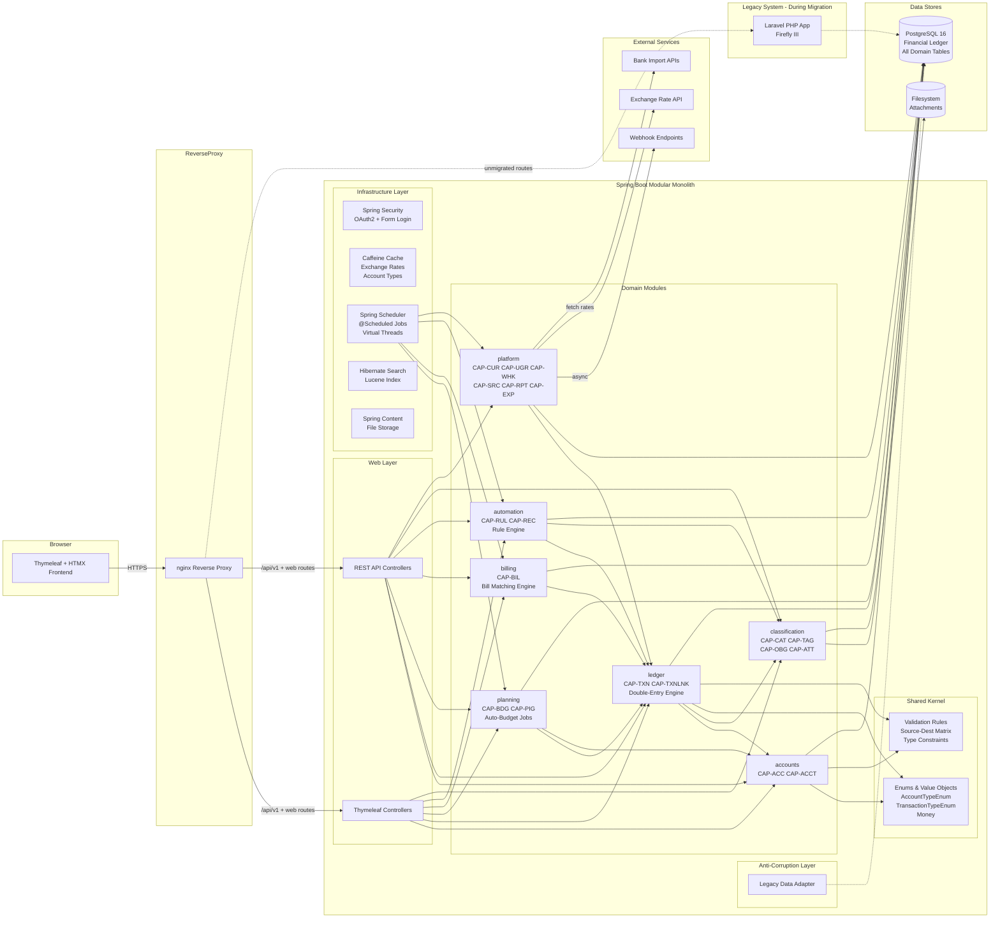
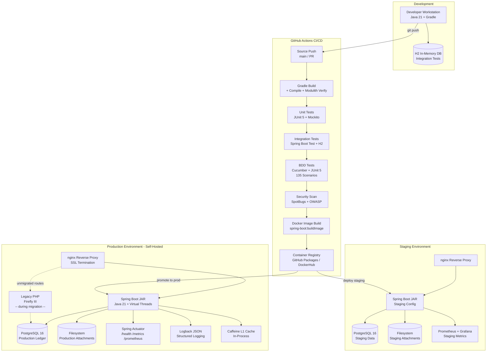
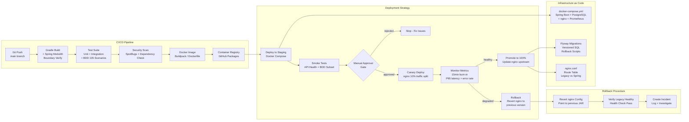

# Firefly III → Java/Spring/Thymeleaf Modernization Approach

## 1. TARGET ARCHITECTURE

### 1.1 Architecture Pattern: Modular Monolith

**Justification:** Firefly III is a self-hosted personal finance manager — a single-user/small-household application deployed on personal infrastructure. A microservices architecture would introduce unwarranted operational complexity (container orchestration, service discovery, distributed transactions) for a system that:
- Runs on a single host (Raspberry Pi, NAS, VPS) per its deployment model
- Has tight domain coupling — transactions reference accounts, budgets, categories, tags, and bills simultaneously (Stage 3: CAP-TXN is the central hub)
- Requires double-entry bookkeeping ACID guarantees that span accounts and journals

A **modular monolith** with clear internal module boundaries provides:
- Clean separation of concerns along the 7 domain boundaries from Stage 3
- Single deployment artifact (executable JAR/WAR) matching the self-hosted deployment model
- ACID transactions across modules via a single database connection
- Future option to extract modules into services if multi-tenant SaaS is pursued

### 1.2 Service/Module Boundaries (aligned to Stage 3 Capability Map)

| Module | Stage 3 Domain | Capabilities | Spring Package |
|--------|---------------|-------------|----------------|
| `accounts` | D1: Financial Accounts | CAP-ACC, CAP-ACCT (Account CRUD, Account Types, Opening Balances) | `com.firefly.accounts` |
| `ledger` | D2: Transaction Ledger | CAP-TXN, CAP-TXNLNK (Double-entry engine, split transactions, links, reconciliation) | `com.firefly.ledger` |
| `planning` | D3: Budget & Planning | CAP-BDG, CAP-PIG (Budgets, limits, auto-budgets, piggy banks) | `com.firefly.planning` |
| `billing` | D4: Bills & Subscriptions | CAP-BIL (Bill management, matching, warnings) | `com.firefly.billing` |
| `automation` | D5: Automation | CAP-RUL, CAP-REC (Rule engine, rule groups, recurring transactions) | `com.firefly.automation` |
| `classification` | D6: Classification | CAP-CAT, CAP-TAG, CAP-OBG, CAP-ATT (Categories, tags, object groups, attachments) | `com.firefly.classification` |
| `platform` | D7: Platform Services | CAP-CUR, CAP-UGR, CAP-WHK, CAP-PREF, CAP-SRC, CAP-RPT, CAP-EXP, CAP-CRON, CAP-ADM | `com.firefly.platform` |

Each module is a separate Java package with:
- Public API interface (`*Service.java`) — the only exported contract
- Internal package-private implementations
- Own JPA entities and Spring Data repositories
- Module-scoped Thymeleaf templates under `templates/{module}/`

**Inter-module communication:** Direct method calls through service interfaces (no REST/messaging between modules). Spring's `@Transactional` propagation handles cross-module ACID requirements (critical for double-entry bookkeeping in CAP-TXN).

### 1.3 Technology Stack

| Layer | Technology | Rationale |
|-------|-----------|----------|
| **Language** | Java 21 LTS | Per user requirement. LTS ensures long-term support. Virtual threads (Project Loom) for async cron jobs. |
| **Framework** | Spring Boot 3.3+ | Per user requirement. Mature ecosystem, auto-configuration, embedded Tomcat for self-hosted deployment. Spring Modulith for enforcing module boundaries. |
| **Frontend** | Thymeleaf 3.1 | Per user requirement. Server-side rendering matches current Blade templating model. No SPA JS build complexity. HTMX fragments for interactive updates without full page reloads. |
| **ORM** | Spring Data JPA + Hibernate 6 | Type-safe entity mapping for double-entry ledger. Optimistic locking for concurrent journal writes. |
| **Database** | PostgreSQL 16 (primary), H2 (dev/test) | PostgreSQL matches existing Firefly III support. ACID compliance for double-entry. `DECIMAL` precision for financial amounts. H2 for fast integration tests. |
| **Caching** | Caffeine (in-process) | Self-hosted single-instance model doesn't need distributed cache. Eliminates Redis dependency and the cascading rollback risk identified in prior validation (Wave 0 ↔ Wave 3 Redis dependency). Caffeine provides L1 caching for exchange rates, account types, preferences. |
| **Job Scheduling** | Spring Scheduler + `@Scheduled` | Replaces Laravel cron commands (AutoBudgetCronjob, BillWarningCronjob, RecurringCronjob, ExchangeRatesCronjob). Runs in-process — no external queue needed. For long-running jobs: `@Async` with virtual threads. |
| **Search** | Hibernate Search 7 (Lucene backend) | Embedded full-text search replaces PHP search. No external Elasticsearch needed — consistent with self-hosted model. |
| **Security** | Spring Security 6 | OAuth2/session auth, CSRF protection, method-level `@PreAuthorize` for admin routes. Replaces Laravel Passport. |
| **File Storage** | Spring Content (filesystem) | Attachments stored on local filesystem, matching self-hosted model. Abstraction allows future S3 support. |
| **Migration Tool** | Flyway | SQL-based migrations from existing schema. Explicit versioning for rollback support. |
| **Build** | Gradle 8 (Kotlin DSL) | Multi-module build. `spring-boot-gradle-plugin` for executable JAR. |
| **Monitoring** | Micrometer + Prometheus + Spring Boot Actuator | `/actuator/health`, `/actuator/metrics`. Self-hosted users can optionally run Prometheus + Grafana. |

### 1.4 API Design

**Strategy:** REST API with OpenAPI 3.0 contracts, maintaining backward compatibility with existing Firefly III API v1.

| Aspect | Decision | Rationale |
|--------|---------|----------|
| **Protocol** | REST over HTTPS | Matches existing API surface (Stage 2: all 50+ endpoints are REST). Ecosystem tooling (mobile apps, bank importers) depends on REST. |
| **Contract** | OpenAPI 3.0 generated from `@RestController` annotations via SpringDoc | Machine-readable spec enables client generation. Existing Firefly III API clients can validate compatibility. |
| **Versioning** | URI prefix `/api/v1/`, `/api/v2/` | Matches existing legacy URL scheme. V1 maintained as compatibility layer during migration. |
| **Pagination** | Spring Data `Pageable` → JSON:API-style `meta.pagination` | Matches existing Firefly III API pagination format. |
| **Error Format** | RFC 7807 Problem Details | Spring Boot 3 native support. Structured error responses for rule validation failures (BR-RUL-003), account type mismatches (BR-ACC-003). |
| **Authentication** | Bearer tokens (OAuth2) + Session cookies (Thymeleaf) | API uses OAuth2 Resource Server; web UI uses form login with CSRF. |

**Thymeleaf Frontend Routes:**
- `/dashboard` — Overview with net worth, recent transactions, budget summaries
- `/accounts/{type}` — Account listing by type (asset, expense, revenue, liability)
- `/transactions/{type}` — Transaction listing with filters
- `/budgets` — Budget overview with limit progress bars
- `/bills` — Bill/subscription management
- `/rules` — Rule engine configuration
- `/reports/{type}` — Chart.js-powered reports rendered via Thymeleaf fragments

---

## 2. ARCHITECTURE DIAGRAM

*See `architectureMermaid` field.*

---

## 3. MIGRATION STRATEGY

### Overall Pattern: Strangler Fig + Parallel Run

The migration uses **Strangler Fig** as the primary pattern: new Java/Spring modules progressively replace legacy PHP routes behind a reverse proxy (nginx). An **Anti-Corruption Layer (ACL)** translates between the legacy Laravel models and new JPA entities during the coexistence period.

**Critical Design Decision — No Redis Dependency:** To address the cascading rollback risk identified in prior validation (Wave 0 Redis rollback breaking Wave 3 async jobs), the architecture uses **Caffeine (in-process cache)** and **Spring @Scheduled/@Async with virtual threads** instead of Redis. This eliminates cross-wave infrastructure dependencies entirely. Each wave is independently rollback-safe.

---

### Wave 0: Foundation & Infrastructure (Weeks 1–4)

**Scope:** Project scaffolding, database migration tooling, CI/CD pipeline, ACL framework, shared kernel.

**Pattern:** Big bang (infrastructure only — no user-facing changes)

**Deliverables:**
1. Spring Boot project with Gradle multi-module structure (`accounts`, `ledger`, `planning`, `billing`, `automation`, `classification`, `platform`)
2. Flyway baseline migration: snapshot existing PostgreSQL/MySQL schema as V1 baseline
3. Shared kernel: `com.firefly.shared` with enums (`AccountTypeEnum`, `TransactionTypeEnum`), value objects (`Money`, `CurrencyCode`), and the double-entry type constraint matrix from `config/firefly.php:474-575`
4. ACL framework: `LegacyDataAdapter` that reads legacy Firefly III database tables and maps to new JPA entities
5. Spring Security configuration: OAuth2 Resource Server + form login
6. CI/CD pipeline (GitHub Actions): build → test → Docker image → deploy
7. Reverse proxy (nginx) configuration template: route `/api/v1/*` and `/*` to legacy PHP; incrementally redirect to Spring
8. Caffeine cache configuration for exchange rates and account type lookups

**Data Migration:** Flyway baseline — no data movement. Both systems read the same database during coexistence.

**Cutover Criteria:**
- ✅ Spring Boot app starts and passes health check (`/actuator/health`)
- ✅ Flyway baseline applied without errors on copy of production DB
- ✅ All BDD scenarios from Stage 2 have skeleton test classes (Cucumber/JUnit 5)
- ✅ ACL reads legacy `accounts` table and maps to `Account` JPA entity correctly
- ✅ CI pipeline completes in < 10 minutes

**Rollback Plan:** Remove Spring Boot from nginx upstream; legacy PHP continues unchanged. No database schema changes in this wave — zero-risk rollback. Caffeine cache is in-process and requires no external service cleanup.

---

### Wave 1: Classification & Platform Services (Weeks 5–10)

**Scope:** Domains D6 (Categories, Tags, Object Groups, Attachments) and D7 partial (Currency, Preferences, Search).

**Justification:** These are low-coupling leaf domains. Stage 3 identifies CAP-CAT, CAP-TAG, CAP-OBG as having no downstream consumers except Transaction Ledger (which remains on legacy). Currency (CAP-CUR) is a stable reference data domain.

**Pattern:** Strangler Fig — new Spring endpoints activated per-resource behind nginx route rules.

**Implementation:**
1. `classification` module: JPA entities for Category, Tag, ObjectGroup, Attachment with repositories
2. Thymeleaf templates: `/categories`, `/tags`, `/object-groups` pages
3. REST controllers: `/api/v1/categories`, `/api/v1/tags`, `/api/v1/object-groups`, `/api/v1/attachments`
4. `platform.currency` module: Currency CRUD, exchange rate management with `@Scheduled` daily fetch
5. `platform.preferences` module: User preference CRUD
6. `platform.search` module: Hibernate Search index over categories, tags (full transaction search deferred to Wave 2)
7. Attachment file storage via Spring Content (filesystem backend)

**Data Migration:** Shared database — both legacy PHP and Spring read/write same `categories`, `tags`, `object_groups`, `attachments` tables. ACL ensures ID compatibility.

**Dual-Write Safety:** During coexistence, nginx routes API calls to Spring for migrated resources. Legacy Blade views still reference legacy PHP controllers for unmigrated pages. No dual-write needed — single writer per resource at any time.

**Cutover Criteria:**
- ✅ All Stage 2 BDD scenarios pass: BR-CAT-001–006, BR-TAG-001–006, BR-OBG-001–005, BR-ATT-001–006, BR-CUR-001–007 (38 scenarios)
- ✅ API response format matches legacy JSON:API output (automated diff test against legacy responses)
- ✅ Thymeleaf pages render correctly with visual regression tests (screenshot comparison)
- ✅ Attachment upload/download works with existing files on disk
- ✅ P95 response time ≤ 200ms for category/tag CRUD

**Rollback Plan:** Revert nginx routes to PHP upstream for affected paths. Database schema unchanged — no data migration to reverse. Spring app can be stopped without impact to remaining legacy routes.

---

### Wave 2: Accounts & Transaction Ledger (Weeks 11–20)

**Scope:** Domains D1 (Financial Accounts) and D2 (Transaction Ledger) — the core of the system.

**Justification:** This is the **highest-risk, highest-value** wave. Stage 3 identifies CAP-TXN as the central hub with tight coupling to every other domain. Migrated Wave 1 modules (categories, tags) are already on Spring, eliminating cross-system joins for classification.

**Pattern:** Strangler Fig with **Parallel Run** for transaction writes. Both legacy and Spring process transaction creation requests; results compared in shadow mode before Spring becomes primary.

**Implementation:**
1. `accounts` module:
   - JPA entities: `Account`, `AccountMeta`, `AccountType` with all type constraint validations from `config/firefly.php:474-575`
   - Repository layer with `@Query` for net worth calculations, balance snapshots
   - Thymeleaf pages: `/accounts/asset`, `/accounts/expense`, `/accounts/revenue`, `/accounts/liability`
   - Account type validation service encoding `allowed_opposing_types` matrix

2. `ledger` module:
   - JPA entities: `TransactionJournal`, `Transaction`, `TransactionGroup`, `TransactionType`
   - **Double-entry engine service:** Enforces source/destination account type rules per `expected_source_types` config
   - Split transaction support via `TransactionGroup` → multiple `TransactionJournal` entries
   - Foreign currency handling: `foreignAmount`, `foreignCurrencyId` on `Transaction` entity
   - Reconciliation workflow
   - Transaction link management (`TransactionLink`, `LinkType`)
   - Thymeleaf pages: `/transactions/withdrawal`, `/transactions/deposit`, `/transactions/transfer`

3. **Parallel Run subsystem:**
   - Intercept proxy captures transaction write requests
   - Forwards to both legacy PHP and Spring controllers
   - Compares response payloads; logs discrepancies
   - Legacy response returned to client (Spring is shadow)
   - After 2 weeks of zero discrepancies → promote Spring to primary

**Data Migration:** Shared database continues. The `ledger` module's JPA entities map directly to existing `transactions`, `transaction_journals`, `transaction_groups` tables. Flyway migrations add any needed indexes or columns incrementally.

**Cutover Criteria:**
- ✅ All Stage 2 BDD scenarios pass: BR-ACC-001–008, BR-TXN-001–012, BR-LNK-001–006 (26 scenarios)
- ✅ Parallel run: 0 discrepancies over 14 consecutive days on production traffic shadows
- ✅ Double-entry integrity check: sum of all debits = sum of all credits (automated nightly verification)
- ✅ Performance: P95 transaction creation ≤ 300ms; P95 transaction list (paginated) ≤ 500ms
- ✅ Reconciliation workflow produces identical results to legacy
- ✅ Opening balance calculations match legacy output for all accounts

**Rollback Plan:** 
1. Revert nginx routes for `/api/v1/transactions`, `/api/v1/accounts`, and Thymeleaf account/transaction pages to legacy PHP.
2. Wave 1 modules (categories, tags, currency) remain on Spring — no cascade impact.
3. No schema rollback needed (shared database, additive-only Flyway migrations).
4. Parallel run proxy can be re-enabled as shadow mode at any time.

---

### Wave 3: Budget, Bills & Planning (Weeks 21–28)

**Scope:** Domains D3 (Budget & Planning) and D4 (Bills & Subscriptions).

**Justification:** With accounts and transactions on Spring (Wave 2), budgets and bills can directly reference Spring services. Stage 3 shows CAP-BDG depends on CAP-TXN (budget assignment only on withdrawals — BR-BDG-001) and CAP-BIL depends on CAP-TXN (bill matching against transactions).

**Pattern:** Strangler Fig — direct cutover per resource.

**Implementation:**
1. `planning` module:
   - JPA entities: `Budget`, `BudgetLimit`, `AvailableBudget`, `AutoBudget`, `PiggyBank`, `PiggyBankEvent`
   - Budget limit enforcement: validates only withdrawals can be budgeted (BR-BDG-001, `SetBudget` action equivalent)
   - Auto-budget scheduled job: `@Scheduled(cron="0 0 0 * * *")` replaces `AutoBudgetCronjob`
   - Piggy bank account type validation: only asset accounts (per `config/firefly.php:piggy_bank_account_types`)
   - Thymeleaf pages: `/budgets`, `/piggy-banks`

2. `billing` module:
   - JPA entities: `Bill`
   - Bill matching engine: amount range + text pattern matching against new transactions
   - Bill warning scheduled job: `@Scheduled` replaces `BillWarningCronjob`
   - Bill period support: daily, weekly, monthly, quarterly, half-year, yearly
   - Thymeleaf pages: `/bills`

3. Scheduled jobs use **Spring @Scheduled with virtual threads** (no Redis/external queue):
   - `AutoBudgetJob` — creates budget limits on schedule
   - `BillWarningJob` — sends notifications for upcoming bills
   - Jobs run in-process; failures logged to `platform.notification` and exposed via Actuator health indicator

**Data Migration:** Shared database. JPA entities map to existing `budgets`, `budget_limits`, `bills`, `piggy_banks` tables.

**Cutover Criteria:**
- ✅ All Stage 2 BDD scenarios pass: BR-BDG-001–008, BR-BIL-001–008, BR-PIG-001–007 (23 scenarios)
- ✅ Auto-budget cron produces identical budget limits to legacy over 7-day parallel run
- ✅ Bill matching accuracy: 100% match with legacy results on historical transactions
- ✅ Bill warning notifications sent at correct times (±1 minute tolerance)

**Rollback Plan:** Revert nginx routes for budget/bill/piggy-bank paths to legacy PHP. Disable Spring `@Scheduled` jobs; re-enable legacy Laravel scheduler for auto-budget and bill warning crons. Wave 2 (accounts/transactions) stays on Spring — no cascade. **No Redis dependency** means rollback has zero infrastructure side effects.

---

### Wave 4: Automation & Finalization (Weeks 29–36)

**Scope:** Domain D5 (Rule Engine, Recurring Transactions) + remaining D7 (Webhooks, Reporting, Data Export, Admin, Cron Orchestration). Legacy PHP fully decommissioned.

**Pattern:** Strangler Fig for rules/recurring; Big Bang for remaining admin/reporting (low-traffic pages).

**Implementation:**
1. `automation` module:
   - JPA entities: `Rule`, `RuleGroup`, `RuleAction`, `RuleTrigger`, `Recurrence`, `RecurrenceRepetition`, `RecurrenceTransaction`
   - Rule engine: Chain-of-responsibility pattern processing triggers → actions
   - All 28 rule actions from `config/firefly.php:296-326` ported as `RuleAction` strategy implementations
   - Recurring transaction scheduled job: `@Scheduled` replaces `RecurringCronjob`
   - Thymeleaf pages: `/rules`, `/recurring`

2. `platform` module (remainder):
   - Webhook system: JPA entities for `Webhook`, `WebhookMessage`, `WebhookAttempt`; async dispatch via `@Async` with virtual threads
   - User group / multi-tenancy: `@TenantFilter` JPA filter on `user_group_id`
   - Reporting/Insights: Thymeleaf + Chart.js for budget reports, income/expense, net worth over time
   - Data export: CSV/JSON export via streaming `ResponseEntity<StreamingResponseBody>`
   - System admin: user management, configuration (admin-only `@PreAuthorize("hasRole('ADMIN')")`)
   - Cron orchestration: single `@Scheduled` master that invokes AutoBudget, BillWarning, Recurring, ExchangeRate jobs

3. **Legacy PHP Decommission:**
   - Remove nginx PHP-FPM upstream
   - Archive legacy codebase
   - Flyway migration removes any legacy-only columns/tables

**Data Migration:** Final cleanup ETL:
- Remove orphaned records from legacy rule engine tables
- Verify all webhook configurations migrated
- Export full database backup before decommission

**Cutover Criteria:**
- ✅ All remaining Stage 2 BDD scenarios pass: BR-RUL-001–010, BR-REC-001–008, BR-WHK-001–008, BR-UGR-001–005, BR-SRC-001–006, BR-EXP-001–005, BR-CRN-001–006 (48 scenarios)
- ✅ 100% of legacy API endpoints return identical responses from Spring (automated regression suite)
- ✅ All scheduled jobs execute successfully over 14-day burn-in period
- ✅ Webhook delivery success rate ≥ 99.5%
- ✅ Zero P0/P1 bugs in production for 7 consecutive days
- ✅ Total BDD scenario pass rate: 135/135 (100%)

**Rollback Plan:** Re-enable legacy PHP nginx upstream and Laravel scheduler. Since database schema changes in this wave are additive (new indexes, no column drops until decommission), legacy PHP can still read the database. Full rollback window: 30 days after cutover before legacy-only columns are dropped.

---

## 4. INFRASTRUCTURE DIAGRAM

*See `infraMermaid` field.*

---

## 5. TRADEOFF ANALYSIS

### Decision 1: Modular Monolith vs. Microservices

| Aspect | Modular Monolith | Microservices |
|--------|-----------------|---------------|
| **Deployment** | Single JAR, simple self-hosting ✅ | Multiple containers, requires orchestration ❌ |
| **ACID Transactions** | Native cross-module transactions ✅ | Saga pattern needed for double-entry ❌ |
| **Operational Complexity** | Minimal — one process ✅ | Service mesh, discovery, distributed tracing ❌ |
| **Team Size** | Suitable for small team ✅ | Overhead not justified for <5 developers ❌ |
| **Scalability** | Vertical scaling sufficient for personal finance ✅ | Horizontal scaling not needed ⚠️ |
| **Future Extraction** | Spring Modulith enforces boundaries for later extraction ✅ | Already separated ✅ |

**Recommendation:** Modular Monolith. Firefly III's self-hosted model and ACID requirements for double-entry bookkeeping make microservices an anti-pattern here.

### Decision 2: Caffeine (In-Process Cache) vs. Redis

| Aspect | Caffeine | Redis |
|--------|----------|-------|
| **Infrastructure** | Zero external deps ✅ | Requires Redis server ❌ |
| **Rollback Safety** | No cross-wave dependency ✅ | Wave 0 rollback breaks Wave 3 jobs ❌ (prior validation finding) |
| **Self-Hosted Simplicity** | No additional service to manage ✅ | Extra port, memory, configuration ❌ |
| **Distributed Caching** | Single-instance only ⚠️ | Multi-instance support ✅ |
| **Performance** | Sub-microsecond reads ✅ | ~1ms network hop ⚠️ |

**Recommendation:** Caffeine. Single-instance deployment model eliminates the need for distributed cache. This directly addresses the prior validation finding about cascading Redis rollback failures.

### Decision 3: Thymeleaf + HTMX vs. SPA (React/Vue)

| Aspect | Thymeleaf + HTMX | SPA (React/Vue) |
|--------|-----------------|------------------|
| **Per User Requirement** | Matches directive ✅ | Not requested ❌ |
| **Server-Side Rendering** | SEO-friendly, fast initial load ✅ | Requires SSR setup ⚠️ |
| **Build Complexity** | No JS build pipeline ✅ | Webpack/Vite, node_modules ❌ |
| **Interactivity** | HTMX for partial updates ✅ | Full interactivity ✅ |
| **Bundle Size** | HTMX ~14KB ✅ | React ~140KB+ ❌ |
| **Self-Hosted Performance** | Minimal client resources ✅ | Heavy client rendering ⚠️ |

**Recommendation:** Thymeleaf + HTMX. Per user requirement, with HTMX providing dynamic fragments for transaction filtering, auto-complete search, and budget progress updates without full page reloads.

### Decision 4: PostgreSQL vs. MySQL

| Aspect | PostgreSQL | MySQL |
|--------|-----------|-------|
| **Financial Precision** | `NUMERIC` type, superior decimal handling ✅ | `DECIMAL` adequate ✅ |
| **JSON Support** | `jsonb` for flexible metadata ✅ | JSON type ⚠️ |
| **Full-Text Search** | Built-in tsvector (backup to Hibernate Search) ✅ | Limited ❌ |
| **Legacy Compatibility** | Supported by original Firefly III ✅ | Also supported ✅ |
| **Ecosystem** | Flyway, Spring Data JPA full support ✅ | Same ✅ |

**Recommendation:** PostgreSQL as primary; support MySQL via Hibernate dialect abstraction for users migrating from MySQL-based Firefly III installations.

### Decision 5: Spring @Scheduled vs. External Job Queue (RabbitMQ/Kafka)

| Aspect | Spring @Scheduled + @Async | RabbitMQ/Kafka |
|--------|---------------------------|----------------|
| **Deployment** | In-process, zero deps ✅ | External broker required ❌ |
| **Reliability** | Virtual threads handle concurrency ✅ | Guaranteed delivery ✅ |
| **Rollback Safety** | No cross-wave deps ✅ | Broker outage cascades ❌ |
| **Webhook Delivery** | @Async + retry template ✅ | Consumer-based retry ✅ |
| **Self-Hosted** | No extra service ✅ | Broker memory/CPU overhead ❌ |

**Recommendation:** Spring @Scheduled + @Async with virtual threads. Webhook retries use Spring Retry with exponential backoff. Job failures surfaced via Actuator health indicators.

---

## 6. NON-FUNCTIONAL REQUIREMENTS

### 6.1 Performance Targets

| Metric | Target | Measurement |
|--------|--------|-------------|
| Transaction creation (single) | P95 ≤ 300ms | Micrometer timer on `LedgerService.createTransaction()` |
| Transaction list (paginated, 50 items) | P95 ≤ 500ms | Micrometer timer on `TransactionController.list()` |
| Account balance calculation | P95 ≤ 200ms | Micrometer timer; Caffeine cache for repeated lookups |
| Dashboard page load | P95 ≤ 1s | Thymeleaf render time; lazy-load charts via HTMX |
| Category/Tag CRUD | P95 ≤ 200ms | Simple JPA operations |
| API response (any endpoint) | P99 ≤ 2s | Global filter metric |
| Startup time | ≤ 15s | Spring Boot startup event |

### 6.2 Scalability Approach

- **Vertical scaling** is the primary strategy (matches self-hosted model)
- JVM heap: 512MB default, configurable via `JAVA_OPTS`
- Connection pool: HikariCP with 10 connections default (configurable)
- Virtual threads for async operations (webhook delivery, report generation) — no thread pool exhaustion
- Caffeine cache: 10,000 entries max, 5-minute TTL for exchange rates, 1-hour TTL for account types
- Database: indexes on all foreign keys, composite indexes on `(user_group_id, date)` for transaction queries
- **Optional horizontal scaling:** If multi-tenant SaaS is pursued, extract `platform` module; add Redis for distributed cache; add load balancer. Spring Modulith boundaries make this extraction feasible.

### 6.3 Security Architecture

| Layer | Implementation | Reference |
|-------|---------------|----------|
| **Authentication** | Spring Security 6 with form login (Thymeleaf) + OAuth2 Bearer (API) | Replaces Laravel Passport |
| **Authorization** | Method-level `@PreAuthorize` annotations; admin routes require `ROLE_ADMIN` | BR-UGR-001–005 |
| **Multi-Tenancy** | Hibernate `@Filter` on `user_group_id`; all queries scoped automatically | CAP-UGR |
| **CSRF** | Spring Security CSRF tokens in Thymeleaf forms | Standard Spring Boot default |
| **Password Storage** | BCrypt via `PasswordEncoder` | Matches Laravel bcrypt |
| **Input Validation** | Bean Validation (`@Valid`, `@NotNull`, `@DecimalMin`) on all DTOs | All BR-TXN, BR-ACC scenarios |
| **SQL Injection** | JPA parameterized queries; no raw SQL | Framework-enforced |
| **XSS** | Thymeleaf auto-escaping (`th:text`); Content-Security-Policy headers | Default Thymeleaf behavior |
| **Rate Limiting** | Spring Cloud Gateway filter (optional) or Bucket4j | API protection |
| **Secrets** | Spring Boot `application.yml` with env variable interpolation; Docker secrets support | Self-hosted deployment |
| **Attachment Security** | MIME type validation against allowlist from `config/firefly.php:allowedMimes` | BR-ATT-003 |

### 6.4 Observability Strategy

| Pillar | Technology | Details |
|--------|-----------|--------|
| **Metrics** | Micrometer → Prometheus | JVM metrics, HTTP request metrics, custom business metrics (transactions/day, rule executions/day). Exposed at `/actuator/prometheus`. |
| **Health Checks** | Spring Boot Actuator | `/actuator/health` with custom indicators: DB connectivity, Flyway migration status, cron job last-run timestamps, disk space for attachments. |
| **Logging** | SLF4J + Logback | Structured JSON logging. MDC with `userId`, `userGroupId`, `requestId` for tracing. Log levels configurable per module via `application.yml`. |
| **Tracing** | Micrometer Tracing (OpenTelemetry) | Request correlation across service methods. Optional export to Jaeger/Zipkin for self-hosted users who want distributed tracing. |
| **Alerting** | Actuator health + optional Prometheus AlertManager | Health endpoint degraded → alert. Cron job missed schedule → alert. |
| **Audit Log** | JPA `@EntityListeners` + `AuditingEntityListener` | `createdAt`, `updatedAt`, `createdBy` on all entities. Optional audit trail table for financial compliance. |

---

## 7. DEPLOYMENT DIAGRAM

*See `deployMermaid` field.*

---

## Appendix: Wave Summary

| Wave | Weeks | Domains | Scenarios | Risk | Rollback Complexity |
|------|-------|---------|-----------|------|--------------------|
| 0 | 1–4 | Foundation | 0 (infra) | Low | Trivial (remove Spring) |
| 1 | 5–10 | D6, D7 partial | 38 | Low | Simple (revert nginx routes) |
| 2 | 11–20 | D1, D2 | 26 | **High** | Medium (revert routes + disable parallel run) |
| 3 | 21–28 | D3, D4 | 23 | Medium | Simple (revert routes + re-enable legacy crons) |
| 4 | 29–36 | D5, D7 remainder | 48 | Medium | 30-day window before schema cleanup |
| **Total** | **36 weeks** | **All 7 domains** | **135 BDD scenarios** | | |

## Architecture Diagram

## Infrastructure Diagram

## Deployment Diagram
